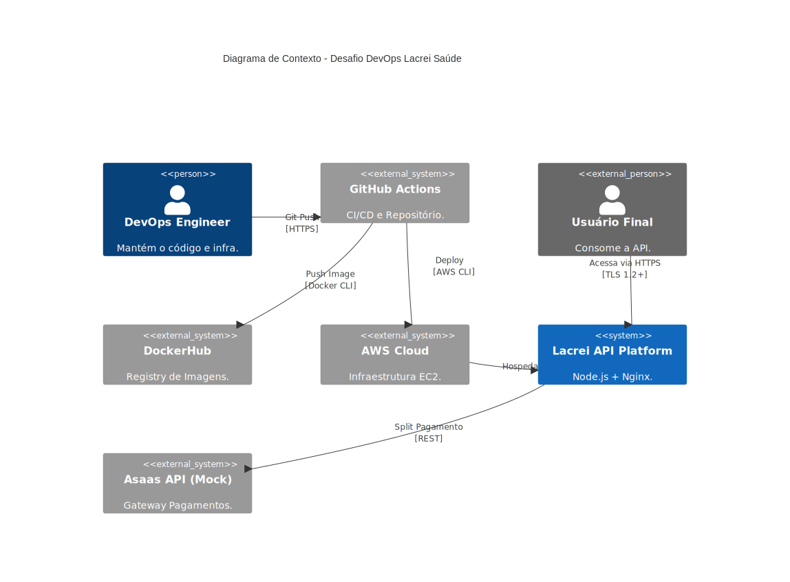

# Desafio DevOps Lacrei Saúde 🏳️‍🌈🚀

Este repositório contém a solução para o desafio técnico de DevOps da Lacrei Saúde. O objetivo foi construir uma infraestrutura segura, escalável e automatizada para deploy de uma aplicação Node.js na AWS, simulando um ambiente real de produção.

## 🏗️ Arquitetura da Solução

A infraestrutura foi desenhada seguindo os princípios de **IaC (Infraestrutura como Código)** e **Imutabilidade**.

* **Compute:** Instâncias AWS EC2 provisionadas via Terraform (T3.micro).
* **OS:** Ubuntu Server 22.04 LTS.
* **Containerização:** Docker para isolamento da aplicação e dependências.
* **Web Server/Proxy:** Nginx atuando como Reverse Proxy e terminador SSL (HTTPS).
* **Segurança:** HTTPS forçado (TLS 1.2+), Security Groups restritivos e IAM Roles.
* **CI/CD:** GitHub Actions para automação completa (Build -> Test -> Deploy).

### 🔄 Fluxo de CI/CD (Pipeline)

O pipeline foi desenhado para ser "Zero Touch" e resiliente a mudanças de IP:

1.  **Build & Security:** O GitHub Actions constrói a imagem Docker, utiliza `pnpm` para gestão segura de pacotes e realiza auditoria de vulnerabilidades.
2.  **Publish:** Envia a imagem versionada (SHA e latest) para o DockerHub.
3.  **Dynamic Discovery:** O pipeline consulta a API da AWS para descobrir os IPs atuais das máquinas de Staging e Produção baseado em Tags (`Project=lacrei-devops`). Isso elimina a necessidade de IPs fixos e permite recriar a infraestrutura sem quebrar o deploy.
4.  **Deploy Staging & Production:** Conecta via SSH, baixa a nova imagem e reinicia o serviço sem downtime perceptível.

O diagrama abaixo ilustra o fluxo implementado no GitHub Actions:

<p align="center">
  
</p>

---

## 🔒 Checklist de Segurança e Decisões Técnicas

Seguindo o princípio de *Security by Design*:

* [x] **HTTPS/TLS Obrigatório**: Implementado via Nginx (Proxy Reverso) redirecionando todo tráfego HTTP (80) para HTTPS (443).
* [x] **Princípio do Menor Privilégio**: Security Groups liberam apenas portas Web (80/443) e SSH (22). A aplicação Node.js roda na porta 3000, isolada da internet pública.
* [x] **Container Seguro (Non-Root)**: O Dockerfile foi configurado para rodar com usuário limitado (`USER node`), mitigando riscos de escalada de privilégio.
* [x] **Gestão de Dependências**: Substituição do `npm` pelo `pnpm` para garantir maior integridade (prevenção de phantom dependencies) e velocidade de build.
* [x] **Secrets Management**: Nenhuma credencial hardcoded. Uso estrito de GitHub Secrets.

[x] CORS: API configurada para aceitar requisições de origens controladas.

### 🛠️ Desafios e Resolução de Erros (Troubleshooting)

Durante o desenvolvimento, os seguintes desafios foram superados:

1. **Tamanho do Binário Terraform (GH001)**: O git push falhou inicialmente devido ao arquivo binário do provider AWS exceder 100MB.
    * **Solução**: Implementação rigorosa de `.gitignore` excluindo a pasta `.terraform` e limpeza do cache git.
2. **IPs Dinâmicos na AWS**: Destruir e recriar a infraestrutura via Terraform alterava os IPs, o que quebraria um pipeline com IPs fixos nos Secrets.
    * **Solução**: Implementação de "Dynamic Discovery" no GitHub Actions, que consulta a API da AWS para encontrar os IPs atuais baseados em Tags.
3. **Segurança da Cadeia de Suprimentos**:
    * **Decisão**: Migração de `npm` para `pnpm` para garantir um lockfile mais estrito e auditar vulnerabilidades nativamente.

## 💰 Bônus: Integração Asaas

Foi implementada uma rota de Mock para simular a arquitetura de split de pagamentos sugerida no desafio.

* **Rota**: `POST /api/asaas/payment-split`
* **Comportamento**: Retorna uma simulação de transação com status `PENDING` e divisão de valores (split) entre a plataforma e o profissional, validando a lógica de integração.

---

## 🛠️ Como Executar (Setup)

### Pré-requisitos
* Terraform >= 1.2
* Conta AWS configurada (AWS CLI)
* Chave SSH gerada localmente (`~/.ssh/lacrei_key`)

### 1. Provisionar Infraestrutura
```bash
cd terraform
# O provider AWS está configurado para ler as credenciais/região do ambiente
terraform init
terraform apply -auto-approve
```

### 2. Configurar GitHub Actions

Adicione os seguintes Secrets no repositório:

* `AWS_ACCESS_KEY_ID` & `AWS_SECRET_ACCESS_KEY`: Para busca dinâmica de IPs.
* `AWS_REGION`: A região utilizada (ex: `us-east-1`).
* `AWS_PRIVATE_KEY`: Conteúdo da sua chave privada SSH.
* `DOCKER_USERNAME` & `DOCKER_PASSWORD`: Credenciais do DockerHub.

## 🔄 Estratégia de Rollback

Em caso de falha crítica após um deploy em Produção, a estratégia de rollback adotada é a **Reversão de Imagem (Image Rollback)**.

**Procedimento**:

1. Identificar a última tag estável no DockerHub (ex: `sha-antigo`).
2. Disparar manualmente o workflow "Revert" (ou executar via SSH):

```bash
# Exemplo de Rollback Manual
docker stop lacrei-app
# Roda a versão anterior específica
docker run -d --restart always -p 3000:3000 --name lacrei-app meu-user/lacrei-app:sha-anterior
```
## 📊 Observabilidade

* **Logs de Aplicação**: Acessíveis via `docker logs lacrei-app` nas instâncias.
* **Monitoramento (CloudWatch)**: A infraestrutura foi provisionada com `IAM Roles (CloudWatchAgentServerPolicy)` anexadas às instâncias. Isso prepara o ambiente para ingestão nativa de métricas e logs no AWS CloudWatch sem expor chaves de acesso na máquina.
* **Healthcheck**: Rota `/status` fornece saúde da API em tempo real.

---

Feito por **Ícaro Torres**.